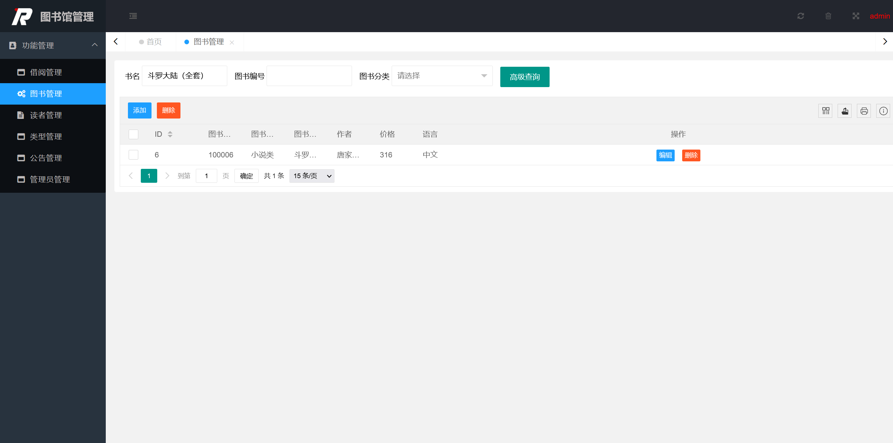

## 图书管理系统

## 1、引言

随着科技的发展，尤其是计算机技术的迅猛发展，图书馆管理的问题从以往的人工管理，到现在的电脑化，系统化，是对图书馆管理方法的质的飞跃，这些技术不仅让图书馆管理变得更加方便、快捷、提高效率，对于用户来说也是有极大地帮助，系统化的图书馆让人们可以更方便的去找书，借书，还书等等一系列的功能，从而让图书馆实现了它的最大化价值。同时对于图书馆本身来说，通过系统，它可以提高图书管理的效率,也是图书馆的科学化、正规化管理的最好方法。所以，图书馆管理系统的研究开发，是一个特别值得去做的研究。

图书管理系统对于现代图书馆而言，是能否发挥其教学科研的作用的至关重要技术平台。对于读者和图书管理员来说，是能否方便快速获取信息的关键。所以，图书管理系统应该能够为用户提供充足的信息和快捷方便的操作手段。因此我们以减少人力成本和管理费用，提高信息的准确性和信息的安全，改进管理服务和良好的人机交互界面为目标，力求完成一套较为完善的图书管理系统数据库设计，来适用于中小型图书管理系统。

##  2、需求分析      

### 2.1、需求分析

**(1) 信息要求**

该系统主要记录读者、图书、登录用户、和管理员四实体的基本情况。

读者基本信息

读者基本信息包括: 用户名、登录密码、读者id、最大借书量、姓名、性别、出生日期、电话号、邮箱地址、创建时间、借书卡号。

图书基本信息

图书基本信息包括：书籍名、作者、出版社、图书id、书籍编号、书籍现存量、书籍介绍、语言类型、价格、书籍入库时间、图书类型号、是否正在借书。

用户登录基本信息

用户登录信息包括：用户名、用户密码、用户类型。

管理员基本信息

管理员基本信息包括：用户id、用户名、密码、权限。

图书类别基本信息

图书类别基本信息包括：类别id、类别、名称、类别编号。

借阅基本信息

借阅信息基本信息包括：借阅id、借阅编号、书籍编号、读者编号、借出日期、归还日期、归还类型、归还情况。

归还类别基本信息

类别基本信息：归还类别号、归还类别。

**(2) 安全性要求**

①数据要绝对安全，防止有意无意的破坏数据。若数据遭到破坏，系统具有数据恢复功能，不可恢复的数据仅限于当日录入和修改的数据。

②各分部用户仅能录入、修改和查询与该分部用户有关的数据。

③各分部的数据录入只能在规定的时间范围内由规定的授权用户完成，超过规定的时间段将不能再对数据进行修改。

④图书管理员和系统管理员必须严格控制对数据的修改，只能数据录入的用户才有权对数据进行修改。

⑤使通过该图书管理系统浏览和查询本系统提供的服务信息的用户确信这些信息是完整的, 任何非授权形式的信息创建、插入、删除和篡改都是不允许的。针对于本系统的用户的用户密码以及个人隐私信息都是非公开的。

⑥数据库服务器中，包括图书信息、借阅图书记录、客户账号等在内的相关数据的安全问题，是保证图书管理系统正常运转的重要因素。要采取严格的防范措施，同时，当发生数据故障的时候，要在最短的时间内恢复数据与系统。

**(3）完整性需求**

①实体完整性

读者编号姓名和读者、书籍编号和书名、书籍类型号、管理员用户名、借阅编号读者编号和书籍编号、管理员用户名密码、归还书籍类型号分别为读者表、图书表、书籍类型表、管理员表、借阅记录表、用户登录信息表、归还类型号的主码。

②参照完整性

图书表中的书籍类型号参照书籍类型表中的类型号；

借阅信息表中的借书卡号编号参照读者表中的读者编号；

借阅信息表中的书籍编号参照图书表中的书籍编号；

借阅信息表中的读者姓名参照读者表中的姓名；

借阅信息表中的归还类型号参归还类型表中的类型号；

③用户定义的完整性

读者表中的性别为：男/女；

图书表中的价格为：0~9999；

用户登录表中的用户类型为：读者/管理员；

图书表中的现存数量为：0-99999999；

如果图书已经被借出怎不能再申请借书；

如果图书没有被借出则不能申请还书；

如果超过免费借书期限将收取罚金。

**(4) 功能描述**

根据需求分析，得到系统的功能需求。作为一个图书管理系统，应满足借阅管理，图书管理，还书管理，图书类型管理，读者管理，公告管理，管理员管理其功能要求如下：

①借阅管理。读者凭借借书卡号借书，读者录入所借图书信息和借书卡号，如果借书卡号未登记入库，则发出“卡号信息不存在”错误。如果图书未登记入库，则发出“所借图书不存在”。读者成功借书后，将“借书信息”登记到“图书借阅管理库”中，完成后将书本递交读者。 

②图书管理。图书管理员对图书基本情况的增加，删除，修改，查询。

③还书管理。图书管理员根据借阅记录检验图书是否向图书馆外借，如果外接，检验还书信息，通过书籍信息，选择还书类型。读者还书成功后，系统发出“还书成功”信息，并将“还书信息”登记到“图书借阅管理库”中。如果图书破损或者超期，则采取相应罚款措施。

④图书类型管理。管理图书相关类型和备注信息。

⑤读者管理。图书管理员管理读者相关信息，对读者基本信息进行增加，删除，修改，查询。

⑥公告管理。用于图书馆发布相关公告，读者可以阅读公告第一时间了解图书馆的相关信息。

⑦管理员管理。实现对图书管理员的添加，删除，和修改密码。

​																		   图2-1 系统功能框架图

### 2.2、项目环境及结构

数据库：MySql5.7

IDE：IDEA

JDK：JDK1.8

Web容器：Apache Tomcat 8.5

项目管理工具：Maven

后端技术：Spring + SpringMVC + Mybatis（SSM框架）

前端技术：LayUI

## 3、逻辑结构设计 

根据E-R图向关系模型的转换原则，一个实体型转换为一个关系模式，实体的属性就是关系的属性。因此按照图1-1到图1-5中所画的E-R图，本数据库中应当包括7张表：读者表、图书表、图书类型表、借阅表、归还类型表、用户表、公告表。

根据实体型间联系的转换原则：(1)一个1:1联系可以转换为一个独立的关系模式，也可以与任意一端对应的关系模式合并。 (2)一个1:n联系可以转换为一个独立的关系模式，也可以与n端对应的关系模式合并。综上所述，该数据库中的逻辑结构设计如表4-1至表4-6所示。

**表4-1 读者表**

| 中文含义     | 字段名称   | 数据类型 | 长度 | 是否为空 | 备注   |
| ------------ | ---------- | -------- | ---- | -------- | ------ |
| 读者id       | Id         | int      | 11   | No       |        |
| 读者用户名   | username   | varchar  | 25   | No       | 外码   |
| 用户密码     | password   | varchar  | 25   | No       | 外码   |
| 最大借书量   | number     | int      | 10   | No       |        |
| 姓名         | name       | varchar  | 10   | No       | 主码   |
| 性别         | sex        | varchar  | 2    | No       | 男、女 |
| 生日         | birthday   | date     |      | No       |        |
| 借书卡号     | cardnumber | varchar  | 50   | No       | 主码   |
| 电子邮件地址 | email      | varchar  | 50   |          |        |
| 联系电话     | tel        | varchar  | 11   | No       |        |
| 创建时间     | creat_date | varchar  |      | No       |        |

**表4-2 图书表**

| 中文含义   | 字段名称     | 数据类型 | 长度 | 是否为空 | 备注             |
| ---------- | ------------ | -------- | ---- | -------- | ---------------- |
| 图书号     | ISBN         | varchar  | 25   | No       | 主码             |
| 书名       | name         | varchar  | 15   | No       | 主码             |
| 作者       | author       | varchar  | 25   | No       |                  |
| 类别       | type_id      | int      | 10   | No       | 外码             |
| 入库时间   | pub_date     | Date     |      | No       |                  |
| 出版社     | publish      | varchar  | 25   | No       |                  |
| 现存量     | num          | int      | 11   | No       |                  |
| 是否被外借 | status       | int      | 10   | No       | 0没被借，1被借   |
| 图书id     | Id           | int      | 11   | No       |                  |
| 介绍       | introduction | text     |      | No       | 展现是否可以外借 |
| 语言       | language     | varchar  | 20   | No       | 中文/英文        |
| 价格       | price        | double   | 20   | No       |                  |

**表4-3 借阅表**

| 中文含义 | 字段名称  | 数据类型 | 长度 | 是否为空 | 备注 |
| -------- | --------- | -------- | ---- | -------- | ---- |
| 借阅编号 | Id        | int      | 11   | No       | 主键 |
| 图书编号 | book_id   | int      | 11   | No       | 主键 |
| 读者编号 | reader_id | int      | 11   | No       | 主键 |
| 借阅时间 | lend_date | datetime |      | No       |      |
| 归还时间 | back_date | datetime |      | No       |      |
| 归还类型 | type      | int      | 10   | No       | 外键 |
| 归还说明 | remarks   | varchar  | 255  | No       |      |

**表4-4归还类型表**

| 中文含义 | 字段名称 | 数据类型 | 长度 | 是否为空 | 备注 |
| -------- | -------- | -------- | ---- | -------- | ---- |
| 归还号   | Id       | int      | 10   | No       | 主键 |
| 归还类别 | fine     | varchar  | 20   | No       |      |

 **表4-5公告表**

| 中文含义   | 字段名称    | 数据类型 | 长度 | 是否为空 | 备注 |
| ---------- | ----------- | -------- | ---- | -------- | ---- |
| 公告id     | Id          | int      | 11   | No       | 主键 |
| 公告信息   | content     | text     | 50   | No       |      |
| 发布时间   | create_date | date     | 10   | No       |      |
| 发布人编号 | author      | int      | 10   | NO       |      |

**表4-6用户表**

| 中文含义 | 字段名称 | 数据类型 | 长度 | 是否为空 | 备注 |
| -------- | -------- | -------- | ---- | -------- | ---- |
| 用户id   | id       | int      | 11   | No       | 主键 |
| 用户名   | username | varchar  | 20   | No       | 主键 |
| 用户密码 | password | varchar  | 20   | No       |      |
| 用户类型 | type     | int      | 11   | No       |      |

## 4、详细设计

### 4.1、读者管理模块功能设计

#### 4.1.1 读者添加

(1) 功能介绍：添加新的读者，使其能够进入图书系统借阅图书。

(2) 设计思想: 点击添加按钮，进入添加读者界面，文本框显示提示信息，管理员根据提示录入读者信息，如分配卡号，读者用户名，读者真实姓名，以及联系方式和借书数量等。最后点击保存按钮，将读者信息添加到数据库中。

**读者添加** 

#### 4.1.2 读者修改

(1) 功能介绍：对读者需要修改的资料进行重定义。

(2) 设计思想：点击修改按钮，进入修改信息界面，界面文本框显示读者现有信息，清空需要修改的读者信息，对其重新输入，最后点击确认修改按钮，将修改后的读者信息保存到数据库中。

**读者修改**

 

#### 4.1.3 读者删除

(1) 功能介绍：删除数据库中已有读者信息。

(2) 设计思想：选中需要删除的读者，弹出提示框“真的删除吗？”点击确认按钮，将选中的读者信息从数据库中删除。

**读者删除** 

 

#### 4.1.4 读者查询

(1) 功能介绍：查询读者相关信息。

(2) 设计思想：在查询文本框中输入读者卡号，用户名，电话号，点击高级查询按钮，从数据库查出读者相关信息，并显示到读者信息列表中。

**读者查询**

 

### 4.2、系统首页模块功能设计

(1)功能介绍：展示图书管理系统的公告信息，并提供快捷入口。

(2)设计思想：设计4个快捷入口，分别为图书类型管理，图书管理，公告管理，读者管理，点击快捷按钮，跳转到相应页面。使用LayUI前端框架，查询数据库中的每个图书类型的书籍数量，并以饼图的形式展示到首页中。查询数据库中的公告信息，展示到公告文本框中。

**系统首页** 

 

### 4.3、书籍管理模块功能设计

#### 4.3.1、书籍添加

(1)功能介绍：此界面主要完成的功能是往数据库book-info表中添加新书的记录，在确认保存后在`bookinfo`表中可查看最新的记录。

(2)设计思想：添加图书界面，设置各个标签和文本组件，用来填写具体的书籍信息，点击按钮进行保存，`BookController`层接受UI页面的路径获得添加的书籍信息的，并将这些信息封装成一个图书类的对象，调用`bookInfoService.addBookSubmit(bookInfo)`调用数据访问层的方法`bookinfoDao.insert(info)`;来对数据库中书籍信息表的添加。

 

####  4.3.2、图书修改

 (1)功能介绍：此界面完成的功能是编辑修改图书信息，以便随时更新图书信息。

(2)设计思想： 修改界面，设置各个标签和文本组件，用来修改具体的书籍信息，点击确认修改按钮进行修改，`BookController`层通过UI页面的路径获得修改指令并调用业务逻辑层中的`bookInfoService.updateBookSubmit(info)`;业务逻辑层调用数据访问层中的`Update`语句`bookinfoDao.updateByPrimaryKeyWithBLOBs(info)`来对数据库中图书表的信息进行修改。

 

#### 4.3.3、图书删除

(1)功能介绍：此界面完成的功能是删除图书信息。

(2)设计思想：删除界面，点击图书信息后面的修删除按钮进行删除，`Bookcontroller`通过UI页面的路径获得删除指令，调用业务逻辑层`BookInfoServicepl`中的方法`bookInfoService.deleteBookInfoById(list)`业务逻辑层调用数据访问层中的`Delete`语句`bookinfoDao.deleteByPrimaryKey(Integer.valueOf(id))`来对数据库中图书表的信息进行删除。

 

####  4.3.4、图书查找

(1)功能介绍：此界面实现的功能是能够查找所有图书，能够按照书名，图书编号，图书类别，查找图书。

(2)设计思想：点击查询按钮，`Bookcontroller`通过UI页面的路径添加的书籍信息查询根据的属性，调用`BookInServiceImpl`中的方法，然后通过`BookInServiceImpl`调用数据访问层中的`Select`语句根据接受到的属性来对数据库中图书表的信息进行不同的查询。

### 4.4、图书类别模块设计

#### 4.4.1、类别修改

(1)功能介绍：此界面的功能是图书类别编辑。

(2)设计思想：图书类别修改界面，设置各个标签和文本组件，用来修改具体的书籍信息，点击确认修改按钮进行保存，`TypeController`层通过UI页面的路径添加的书籍信息，然后调用业务逻辑层的方法`classService.updateTypeSubmit(info)`;调用数据访问层中的`Update`语句`classDao.updateTypeSubmit(info)`;来对数据库中图书类型表的信息修改。

#### 4.4.2、类别删除

(1)功能介绍：此界面的功能是图书类别删除。

(2)设计思想：设计思想：删除书籍类界面，点击图书类别信息后面的修删除按钮进行删除，`Typecontroller`通过UI页面的路径添加的书籍信息，接受删除指令调用`classService.deleteTypeByIds(list)`;然后业务逻辑层调用数据访问层中的Delete语句来`classDao.deleteTypeByIds(list)`;对数据库中图书表的信息进行删除。

#### 4.4.3、类别查询

(1)功能介绍：此界面实现的功能是能够查找所有图书类别如图5-2-4

(2)设计思想：点击查询按钮，`Typecontroller`通过UI页面的路径获得书籍类型查询的名称，调用`ClassServiceImpl`中的方法，然后通过`CassInServiceImpl`调用数据访问层中的`Select`语句根据接受到的类型名称来对数据库中图书表的信息进行不同的查询。

### 4.5、借阅管理模块功能设计

#### 4.5.1、借阅查询

(1)功能介绍：查询图书信息，方便管理员管理查找用户要借阅的图书。

(2)设计思想：在查询文本框中输入借书卡号，书名，归还类型，图书类型。点击高级查询，同时在数据库中查询出相关图书信息，并显示到图书信息列表中。

#### 4.5.2、借书管理

(1)功能介绍：读者可以借阅未借出的图书。

(2)设计思想:此模块介绍了读者根据管理员所分配的书书卡来作为自身身份信息，借阅图书馆内未借出的图书，点击借阅，成功显示出图书列表信息（包括ID，图书编号，图书类别，图书名称，作者，价格，出版社，语言）。借阅成功后，将该图书编号、借阅日期、ID、读者编号插入到数据库中的借书表中进行记录。

#### 4.5.3、还书管理

(1)功能介绍：管理员管理读者归还所借阅的图书。

(2)设计思想：此模块实现读者凭借所借阅的图书的图书号或者图书名归还图书。管理员根据，读者归还时间判断还书类型，（包括正常还书，延迟还书，破损还书，丢书）对还书类型进行操作，如果发生非正常还书则需要备注罚款信息。管理员对借书记录删除，数据库中也把相应的借书记录删除。

#### 4.5.4、删除借阅记录

(1)功能介绍：管理员删除读者所借阅图书的记录。

(2)设计思想：根据借阅记录的id以及借阅图书信息的id在表中删除，在service层中调用delete对借阅信息进行删除，数据库中相应的借书记录表中的借书信息也被删除。

#### 4.5.5、借阅与归还时间线

(1)功能介绍：管理员根据读者的借阅时间与归还时间来查看借阅与归还时间线。

(2)设计思想：在读者完成借书操作时数据库自动生成借书时间，还书时同样数据库自动生成还书时间。并在前端页面展示。

### 4.6、管理员管理模块功能设计

作为一个管理系统，登录验证是必备的功能之一，是管理员正确管理的保证。系统初始设置一个管理员用户名和密码,操作人员可以利用这个超级用户登录，之后，可以设置其他的操作人员名称。

### 4.7、**公告管理**模块功能设计

 系统公告是方便管理员向读者发送通知图书馆相关公告的模块。使用户可以很方便地了解图书馆动向。

